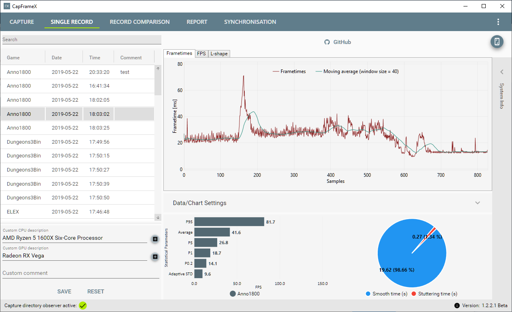

# Welcome to CapFrameX

*CapFrameX* offers a rich feature set to record and analyze GPU and CPU benchmarks.

It enables you to analyze and compare records in multiple ways. The FPS-, Frametime-graphes and L-Shapes are calculated for each record and can be compared among each others. The calculation considers various options, e.g. Shuttering Parameter and Adaptive Scattering Measure.

Although based on PresentMon, which covers all 3D APIs, OCAT records can be imported as well.

## Features

* Recording and analyzing
  * Create FPS- and Frametime-graphes
  * Create L-Shapes (percentiles)
  * Compare records
  * List records in a report
  * Check adaptive synchronization
* In- and Export
  * Read OCAT records
  * Export recordings to Excel

## Screenshots

## Disclaimer

*CapFrameX* is currently under developent and in a beta stage. Bugs might occur - feel free to open an issue or provide a pull request.

## Support and Contact

* ComputerBase.de: [CapFrameX - Capture und Analyse Tool - German user and development forum thread](https://www.computerbase.de/forum/threads/capframex-capture-und-analyse-tool.1851025)
* Twitter: <https://twitter.com/CapFrameX>
* YouTube: [CapFrameX Capture Page Tutorial - Frametimes aufzeichnen [DE]](https://youtu.be/ZqMMPDxJUkk)
